# Student Registration System - Laravel Documentation

## 1. Project Title
**Student Registration System**

## 2. Introduction
The **Student Registration System** is a web-based application designed to transition the College of Information Technology from paper-based student registration to a digital, streamlined process. Its primary purpose is to allow students to register online securely while ensuring all submitted data is accurate and properly formatted. 

Data validation is critical in this system to prevent incomplete or malicious data from entering the database, which could lead to system errors or data integrity issues. In enterprise applications, registration systems serve as the frontline of user interaction and identity management. They act as the gatekeepers, ensuring that only authenticated, valid, and secure user data is integrated into the broader corporate ecosystem (such as learning management systems, billing, and academic records).

## 3. Objectives
During the development of this activity, the following learning objectives were accomplished:
* Developed professional HTML registration forms using Laravel Blade templates.
* Processed client requests and handled user input securely via Laravel controllers.
* Implemented robust server-side validation to prevent invalid submissions.
* Displayed flash messages for successful and failed operations to improve user experience.
* Uploaded and securely stored user profile pictures using Laravel Storage.
* Designed and implemented a relational database table using Laravel Migrations.
* Documented the software development lifecycle and system processes using Markdown.
* Applied Git version control and portfolio-building practices.

## 4. Laravel Request Lifecycle
The Laravel request lifecycle dictates how an incoming client request is processed and how a response is returned. In the context of this Student Registration System:

1. **Browser:** The user fills out the registration form and submits it via a `POST` request.
2. **Route:** The `routes/web.php` file intercepts the request and routes it to the `StudentController@store` method.
3. **Controller:** The controller receives the request and prepares it for validation.
4. **Validation:** The incoming data is passed through Laravel's Validation rules. If it fails, the user is redirected back with error messages.
5. **Model:** If validation passes, the controller interacts with the `Student` model to mass-assign or map the validated data.
6. **Database:** The Model executes an `INSERT` query to store the record in the MySQL database.
7. **Response:** The system redirects the browser to the student profile view, returning an HTTP response accompanied by a success flash message.

**Lifecycle Diagram:**
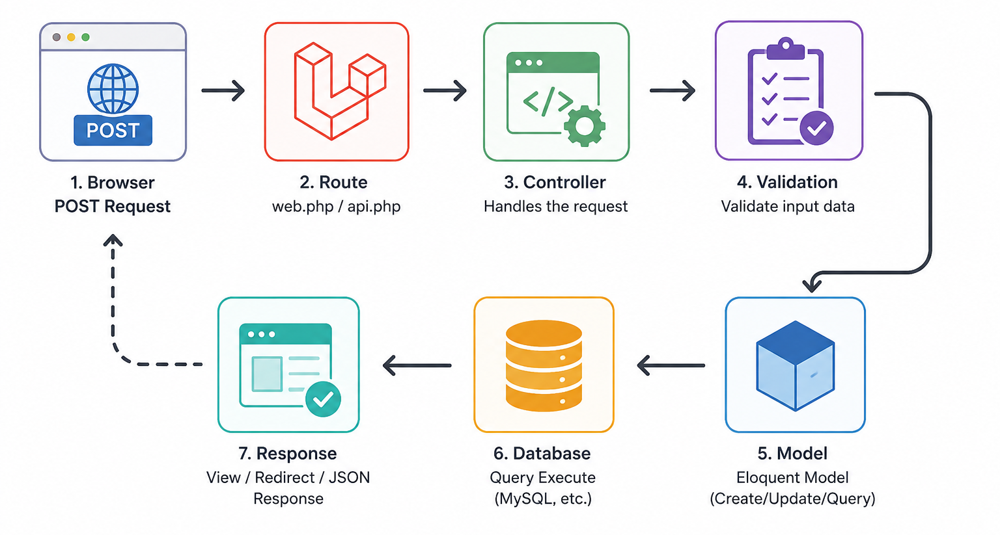

## 5. Validation Rules
Proper data validation ensures system stability and security. The following rules were applied:
* **Required fields (`required`):** Ensures that essential data (e.g., First Name, Last Name, Date of Birth) is not left blank. It prevents the creation of incomplete database records.
* **Unique constraints (`unique:students`):** Applied to the Student ID and Email. It prevents duplicate registrations and ensures identity uniqueness across the system.
* **Email validation (`email`):** Verifies that the input matches standard email formatting (e.g., user@example.com). This is crucial for future communication and account recovery.
* **Numeric validation (`numeric`):** Applied to the Mobile Number. Prevents users from entering letters or symbols in phone number fields, ensuring data consistency.
* **Image validation (`image|mimes:jpg,jpeg,png`):** Restricts the uploaded profile picture strictly to image file formats, blocking potentially malicious executable scripts from being uploaded.
* **File size restrictions (`max:2048`):** Limits the image upload size to 2MB. This protects the server from denial-of-service (DoS) attacks via storage exhaustion and optimizes load times.

## 6. Database Design
**Entity Relationship Diagram (ERD):**
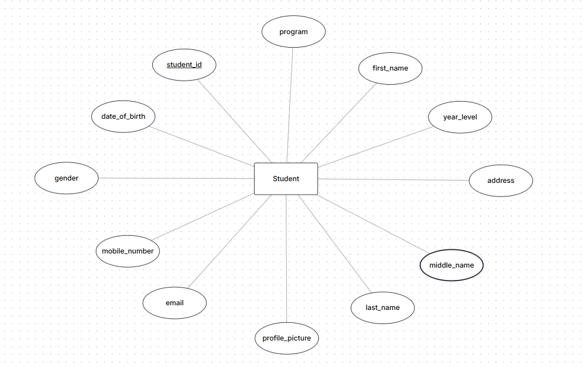

### Table Structure (`students`)
| Column Name | Data Type | Key/Constraint |
| :--- | :--- | :--- |
| `id` | BigInt (Unsigned) | Primary Key, Auto Increment |
| `student_id` | String (Varchar) | Unique, Not Null |
| `first_name` | String (Varchar) | Not Null |
| `middle_name` | String (Varchar) | Nullable |
| `last_name` | String (Varchar) | Not Null |
| `email` | String (Varchar) | Unique, Not Null |
| `mobile_number` | String (Varchar) | Not Null |
| `gender` | Enum / String | Not Null |
| `date_of_birth` | Date | Not Null |
| `program` | String (Varchar) | Not Null |
| `year_level` | String (Varchar) | Not Null |
| `address` | Text | Not Null |
| `profile_picture`| String (Varchar) | Not Null |
| `created_at` | Timestamp | Nullable |
| `updated_at` | Timestamp | Nullable |

## 7. Flowchart
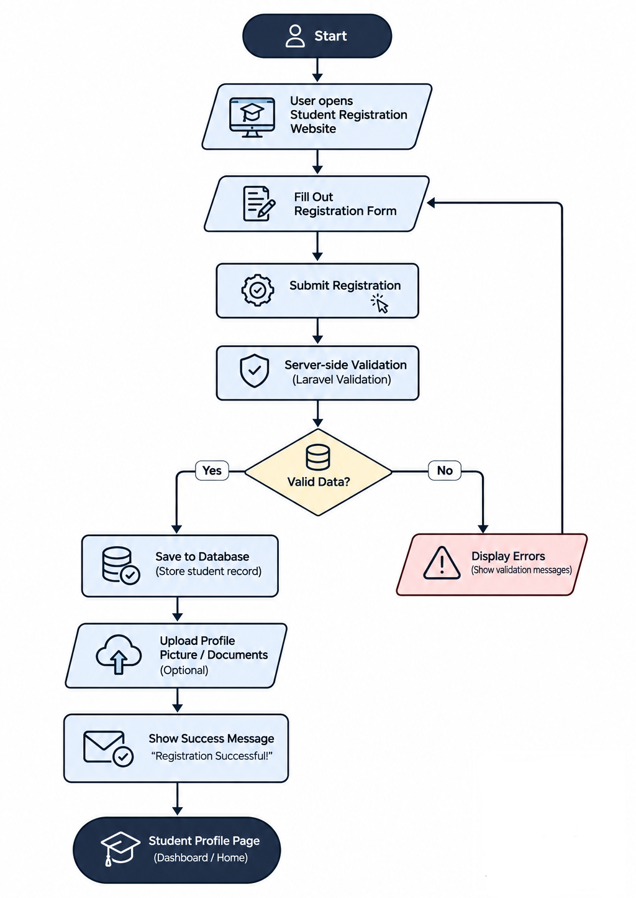

## 8. Screenshots
Below are the visual documentations of the completed project based on the provided screenshots directory:

* **Registration Form:** 
  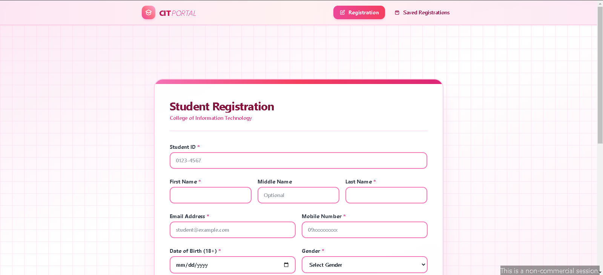
  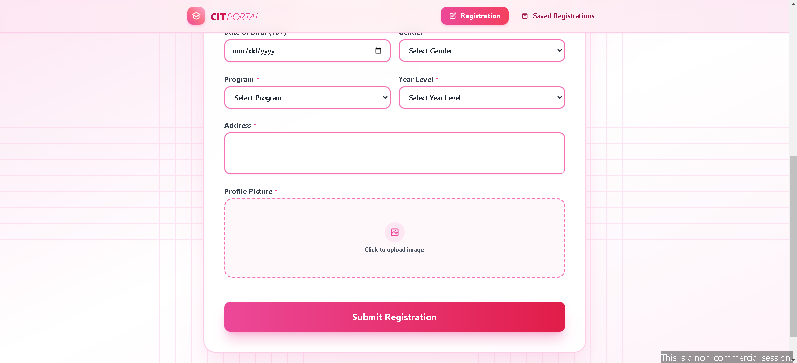
* **Validation Errors:** 
  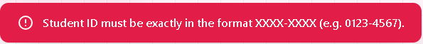
  *(Additional validation error states: screenshots/ValidationError_2.png through 11.png)*
* **Successful Registration / Browser Output:** 
  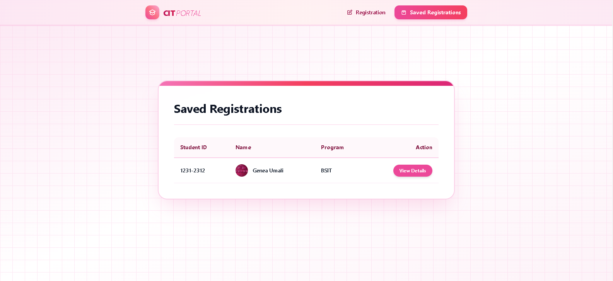
* **Flash Message:** 
  
* **Uploaded Profile Picture:** 
  
* **Database Table:** 
  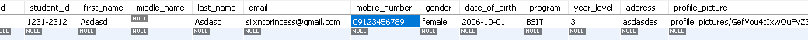
  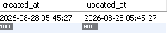
* **Student Profile Page:** 
  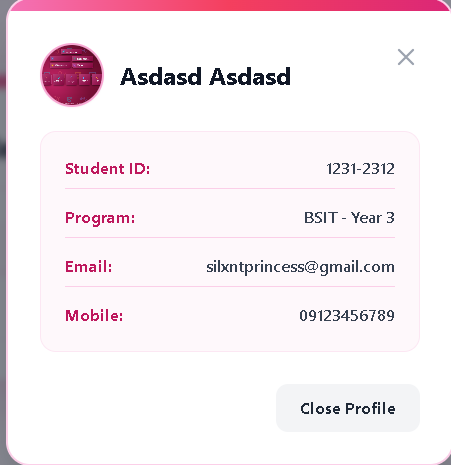
* **VS Code Project Structure:** 
  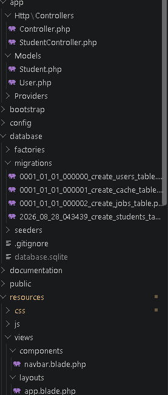
  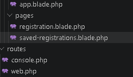
* **Terminal Output:**
  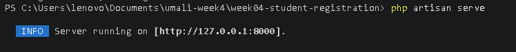
* **GitHub Repository:** 
  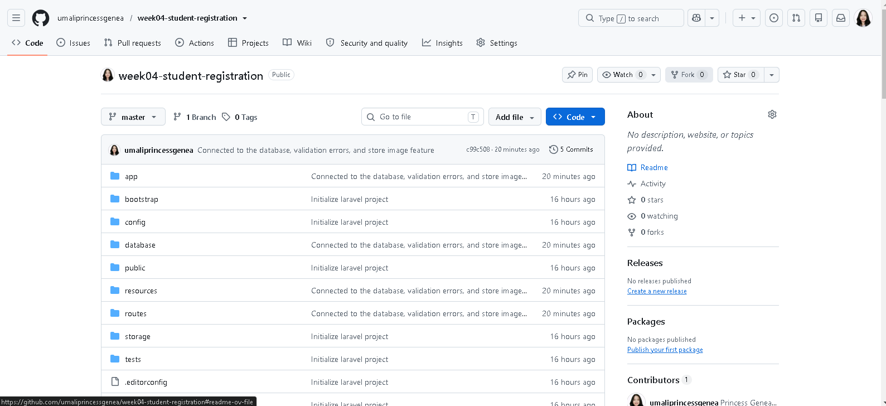

## 9. Problems Encountered
1. **Validation Errors Not Appearing:** Initially, when testing invalid form submissions, the page simply reloaded without displaying any red error messages next to the inputs.
2. **Image Upload Path Incorrect / Not Displaying:** After a successful registration, the database saved the image path, but the image appeared broken on the Student Profile Page.
3. **Database Migration Failed:** When running `php artisan migrate`, an SQL connection error was thrown, preventing the `students` table from being created.

## 10. Solutions
1. **Validation Errors Solution:** I realized I had not added the Blade `@error` directives to the frontend form. By wrapping the error output below each input field (e.g., `@error('student_id') {{ $message }} @enderror`), the validation errors returned by Laravel were correctly displayed to the user.
2. **Image Upload Path Solution:** The files were being saved in the `storage/app/public` directory, but were inaccessible from the web root. I ran the terminal command `php artisan storage:link` to create a symbolic link between `public/storage` and `storage/app/public`. I also updated my blade template to use the `asset('storage/' . $student->profile_picture)` helper function, resolving the broken images.
3. **Database Migration Solution:** The error occurred because the database credentials in the `.env` file were incorrect and the MySQL server (XAMPP/MAMP) was not running. I started the MySQL service, updated the `.env` file with `DB_DATABASE=student_registration`, `DB_USERNAME=root`, and an empty `DB_PASSWORD`, and then successfully reran `php artisan migrate`.

## 11. Reflection
Developing the Student Registration System has provided profound insights into the critical role of data validation, security, and architectural flow in web applications. At its core, the importance of validation cannot be overstated. Without strict validation, a system becomes susceptible to data corruption, inconsistent formatting, and malicious inputs. By implementing comprehensive rules—such as enforcing uniqueness on student IDs, validating email formats, and ensuring mobile numbers are strictly numeric—the application guarantees that the database only ingests clean, usable, and structured data.

Handling user input proved to be an intricate process that required balancing user experience with strict security. Through Laravel's request handling, I learned that user input must always be treated with skepticism. Providing immediate, clear, and contextual feedback (such as retaining old input fields via the `old()` helper and displaying precise error messages) dramatically improves the user experience. It turns what could be a frustrating roadblock into an intuitive correction process for the user. 

This activity strongly reinforced the benefits of server-side validation over client-side validation. While client-side validation (using HTML5 properties like `required` or JavaScript) is excellent for providing instant feedback and reducing unnecessary server requests, it is inherently insecure because it can be easily bypassed using developer tools or custom API requests. Server-side validation, as handled by Laravel's controller, acts as an unbreakable final line of defense, ensuring that regardless of how the request is manipulated on the client side, the application logic strictly enforces the data rules before touching the database.

Furthermore, the importance of file security in web applications became a significant focal point. Uploading files is a high-risk operation. By restricting file types to specific MIME types (jpg, jpeg, png) and setting a strict file size limit (2MB), the application prevents the execution of malicious scripts and mitigates denial-of-service vulnerabilities related to storage exhaustion. Isolating these uploads within a symbolically linked storage directory further protects the application's core logic and structure.

Ultimately, registration systems like this are foundational to real-world enterprise software. Whether in a hospital tracking patient intakes, a university managing enrollment, or an e-commerce platform onboarding new customers, the principles of validating incoming data, managing the request lifecycle efficiently, and securing file handling remain identical. This project has solidified my understanding of how enterprise applications protect their integrity while providing seamless and secure user onboarding experiences.

## 12. References
Laravel. (2023). *Validation*. Laravel Documentation. Retrieved from https://laravel.com/docs/validation

Laravel. (2023). *File Storage*. Laravel Documentation. Retrieved from https://laravel.com/docs/filesystem

MDN Web Docs. (2023). *Client-side form validation*. Mozilla. Retrieved from https://developer.mozilla.org/en-US/docs/Learn/Forms/Form_validation

MySQL. (2023). *MySQL 8.0 Reference Manual*. Oracle Corporation. Retrieved from https://dev.mysql.com/doc/refman/8.0/en/

The PHP Group. (2023). *PHP: Hypertext Preprocessor Documentation*. Retrieved from https://www.php.net/docs.php
